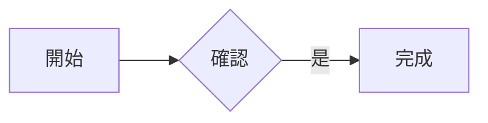
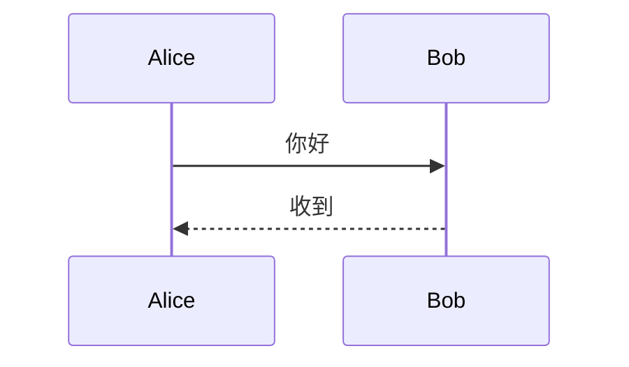
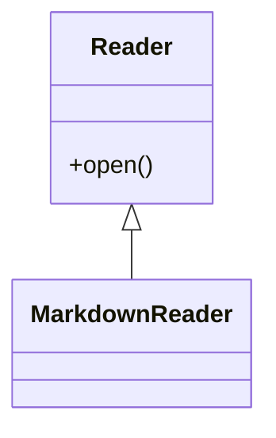
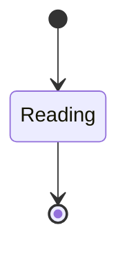
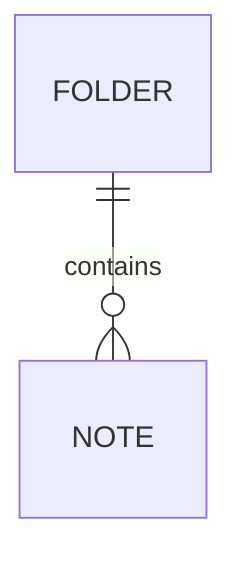

# Mermaid 驗收

```mermaid
flowchart LR
  A[開始] --> B{確認}
  B -->|是| C[完成]
```

```mermaid
sequenceDiagram
  Alice->>Bob: 你好
  Bob-->>Alice: 收到
```

```mermaid
classDiagram
  Reader <|-- MarkdownReader
  Reader: +open()
```

```mermaid
stateDiagram-v2
  [*] --> Reading
  Reading --> [*]
```

```mermaid
erDiagram
  FOLDER ||--o{ NOTE : contains
```

```mermaid
flowchart THIS IS INVALID
```
